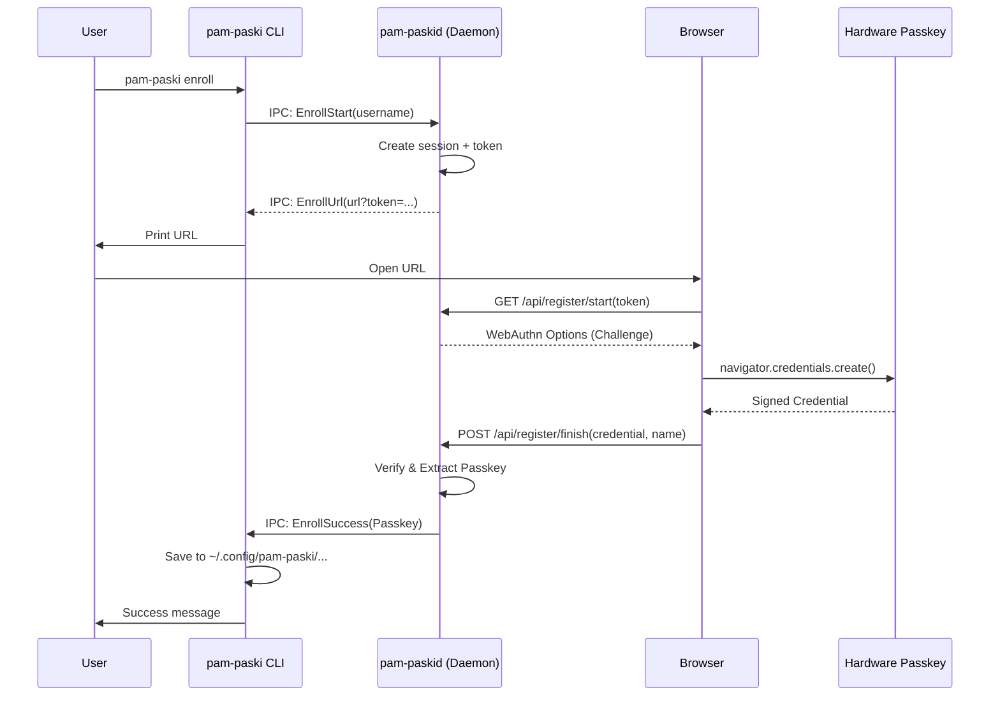
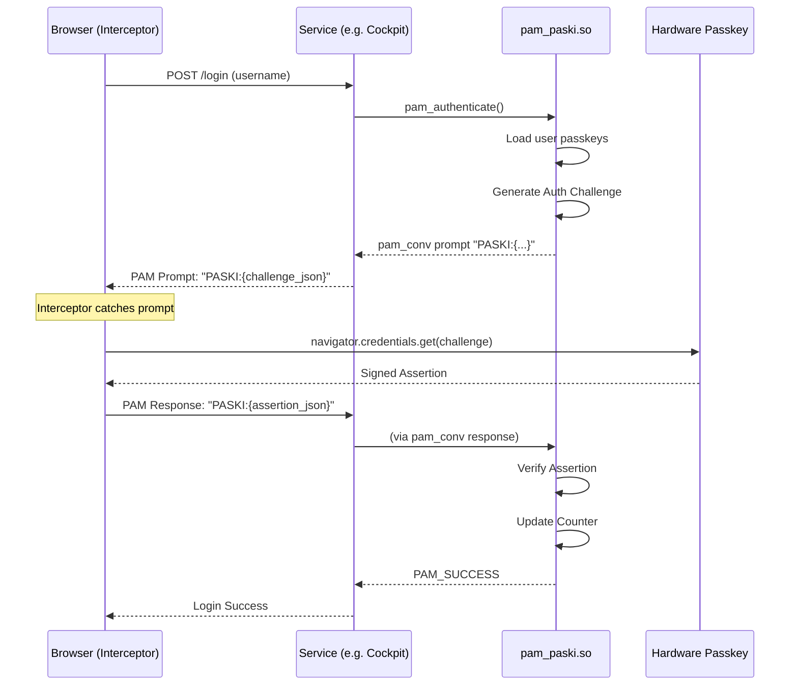

# Design & architecture

This document describes the high-level architecture and flows of `pam-paski`.

## Overview

`pam-paski` consists of four main components that work together to bridge
WebAuthn passkeys with Linux PAM.

### 1. `pam-paskid` (daemon)

The daemon is a long-running service (running as `root`) that provides the
infrastructure for enrollment.

- **Web Server**: Runs an Axum-based HTTPS server (default port 8443) that hosts
  the enrollment and test authentication pages.
- **IPC Listener**: Listens on a Unix socket (`/run/pam-paski/daemon.sock`) for
  commands from the CLI.
- **Cryptography**: Uses the `webauthn-rs` library to handle the server-side
  WebAuthn state machine, challenge generation, and verification.
- **Session Management**: Maintains ephemeral in-memory state for active
  enrollment sessions.
- **Configuration**: Loads a configuration from `/etc/pam-paski/config.yaml`
  which lets it know the "relying party" to operate as and the allowed origins.

### 2. `pam-paski` (CLI)

The command-line tool used by users to manage their own passkeys.

- **Enrollment**: Initiates the enrollment process by talking to the daemon over
  IPC. It receives the final credential from the daemon and saves it to the
  user's home directory.
- **Management**: Lists or removes passkeys by directly modifying the user's
  credential store.
- **Infrastructure**: Handles daemon startup (`serve`) and Cockpit integration
  (`install-cockpit`).

### 3. `pam_paski.so` (PAM Module)

This module integrates WebAuthn verification with the Linux pluggable
authentication system.

- **Standalone operation**: Unlike the CLI, the PAM module **does not**
  communicate with the daemon for authentication. It loads the same
  configuration to verifies credentials.
- **User discovery**: Determines the home directory of the authenticating user
  and loads their passkeys from `~/.config/pam-paski/enrolled_passkeys.json`.
- **PAM conversation**: Uses the standard `pam_conv` mechanism to tunnel
  WebAuthn challenges to the frontend and receive signed assertions back.
- **Counter synchronization**: Updates the WebAuthn signature counter in the
  user's credential file upon successful login to prevent replay attacks.

### 4. WebAuthn Interceptor

A JavaScript component injected into a frontend that already uses PAM for
authentication (currently specifically for Cockpit).

- **Detection**: Monitors the login page for PAM prompts starting with the
  `PASKI:` prefix.
- **Browser ceremony**: Invokes the browser's `navigator.credentials.get()` API
  to interact with the user's passkey (USB, Bluetooth, or platform
  authenticator).
- **Relay**: Encodes the WebAuthn assertion and sends it back to PAM through the
  conversation response field.

---

## Enrollment flow

The enrollment flow is designed to allow a non-privileged user to securely
register a passkey via a web browser while the final secret is stored in their
own home directory.

1.  **Initiation**: The user runs the CLI, which asks the daemon to start a
    session.
2.  **Web handshake**: The user visits the daemon's web server. The `token`
    links the browser session to the specific CLI request.
3.  **Ceremony**: The browser performs the standard WebAuthn registration
    ceremony.
4.  **Completion**: The daemon verifies the result and passes the public key
    data back to the waiting CLI over the Unix socket.
5.  **Persistence**: The CLI (running as the user) writes the passkey metadata
    to the user's local config.

---

## Authentication Flow

The authentication flow uses the PAM conversation to pass large JSON payloads
between the server-side PAM module and the client-side browser.

1.  **Trigger**: The user submits their username to a service (like Cockpit).
2.  **Challenge**: `pam_paski.so` generates a random challenge and a list of
    allowed credential IDs for that user, sending them as a JSON blob prefixed
    with `PASKI:`.
3.  **Interception**: The JavaScript interceptor in the browser sees the prompt,
    prevents it from being displayed to the user, and parses the JSON.
4.  **Assertion**: The browser prompts the user to touch their passkey. The
    resulting assertion (signature) is sent back as a response to the PAM
    prompt.
5.  **Verification**: `pam_paski.so` verifies the signature against the stored
    public key. If valid, it updates the signature counter and grants access.
